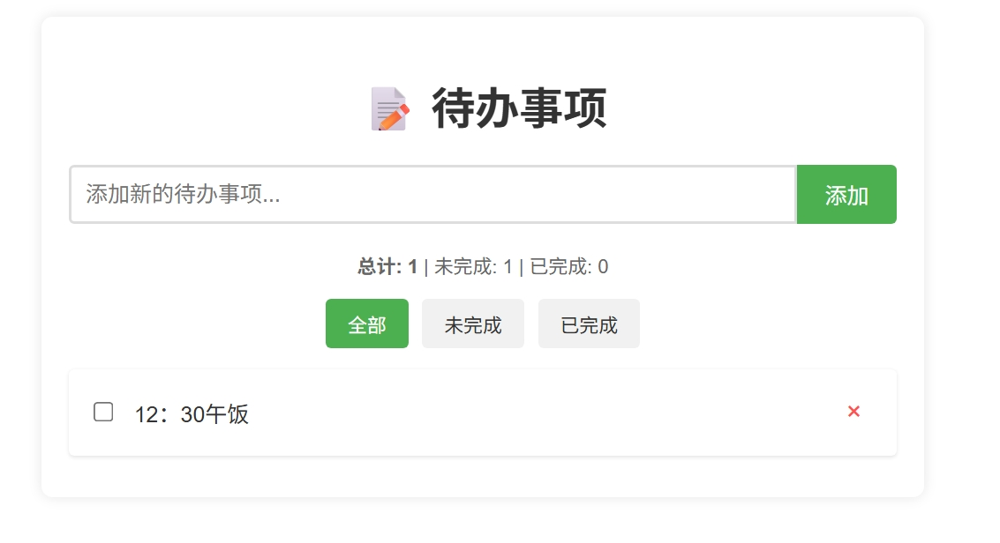

# Todo

> 轻量级纯前端待办事项应用 · 无后端 · 本地存储 · 开箱即用

---

## 📌 简介

一个完全基于前端技术构建的待办事项（Todo）管理工具，无需服务器或数据库，数据保存在浏览器本地（localStorage），适合学习、快速部署或个人使用。

---

## ✅ 功能列表

- ✅ 添加/删除待办事项
- ✅ 标记完成/未完成
- ✅ 本地持久化存储（刷新不丢失）
- ✅ 响应式界面，适配移动端
- ✅ 纯静态文件，无需构建即可运行

---

## 🚀 使用方法

### 本地运行步骤：

1. 下载或克隆本项目：
   ```bash
   git clone https://github.com/yourname/TodoPureFrontend.git
   ```

2. 进入项目目录：
   ```bash
   cd TodoPureFrontend
   ```

3. 直接双击 `index.html`，或使用本地服务器（推荐）：
   ```bash
   npx serve .  # 或 python -m http.server 8000
   ```

4. 在浏览器中打开 `http://localhost:8000`（或对应端口）即可使用。

---

## 🛠️ 技术栈

- HTML5 + CSS3 + JavaScript（ES6+）
- localStorage 数据持久化
- 无框架 / 可选轻量库（如：Bootstrap / Tailwind 可选）

---

## 🖼️ 截图

> 📸 

---

## 📄 开源协议

MIT License — 允许自由使用、修改、分发，保留原作者版权即可。

---

✨ 欢迎 Star、Fork、贡献代码或提交 Issue！
